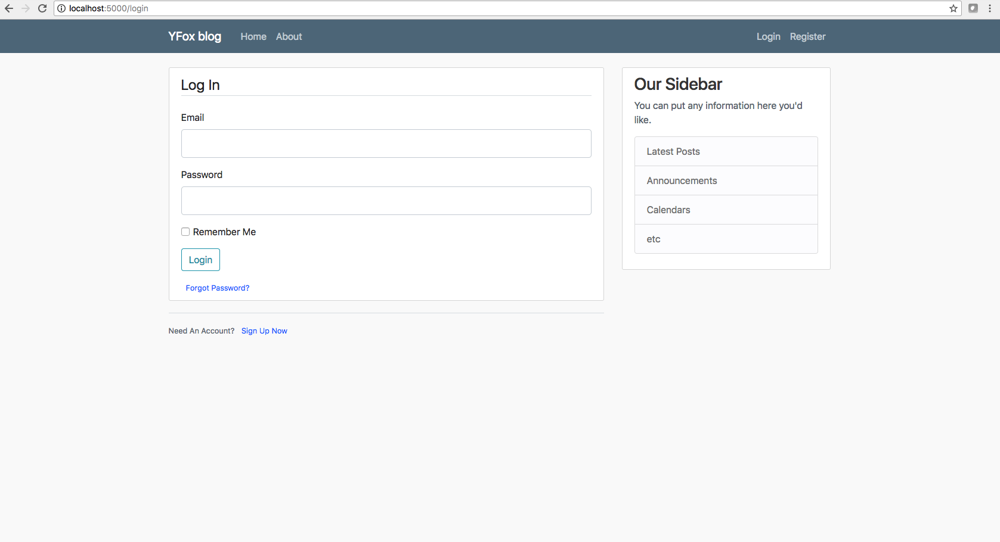
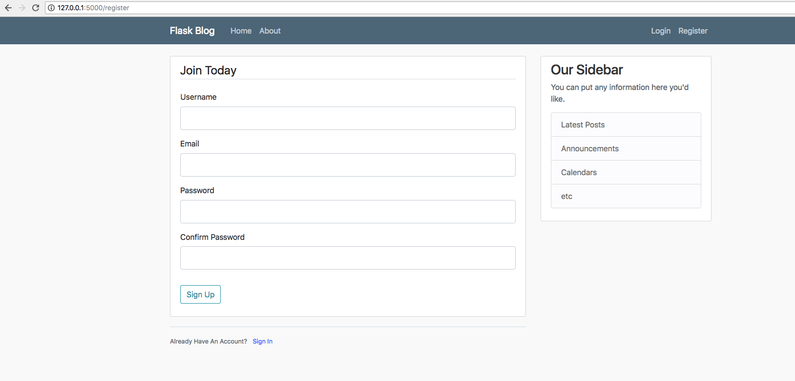
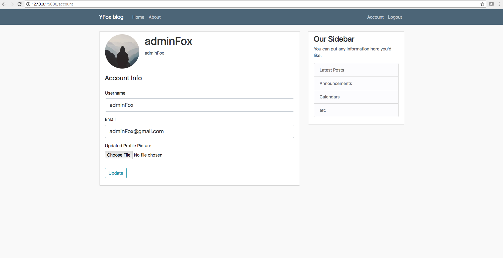

# yFox blog
> Typically a simple blog written in [flask](http://flask.palletsprojects.com/en/1.1.x) python micro-web framework. 
> It is also containerized with [docker](https://www.docker.com) to run web app locally and launch auto tests with [pytest](https://docs.pytest.org/en/latest) at the same time if you would like to. 
>
> You can go to direct hosting link to try it out at [https://vyahfox.pythonanywhere.com](https://vyahfox.pythonanywhere.com). Enjoy it!

[](https://travis-ci.org/vyahello/personal-blog)
[](https://coveralls.io/github/vyahello/personal-blogbranch=master)

> **Tools**
> - python3.6
> - flask
> - sqlalchemy
> - docker

## Content
- [Structure](#structure)
- [Run app blog](#run-app-blog)
  - [Using python runner](#using-python-runner)
  - [Using official app docker image](#using-official-app-docker-image)
- [Run automated tests](#run-automated-tests)
  - [Using shell script](#using-shell-script)
  - [Using official tests docker image](#using-official-tests-docker-image)
  - [Advanced usage with pytest](#advanced-usage-with-pytest)
  - [Testing report](#testing-report)
  - [Run app and automated tests with docker-compose](#run-app-and-automated-tests-with-docker-compose)
- [Development](#development)
  - [Meta](#meta)
  - [Contributing](#contributing)

## Structure
**Home Page**

**About Page**

**Login Page**

**Register Page**

**Account page**

**New Post page**

**Delete Post**


## Run app blog
### Using python runner
Run script from the root directory of the project:
```bash
~ python yfox.py
```

### Using official app docker image
Please use `yfox-blog` docker image with particular version `vyahello/yfox-blog:<tag-version>`:
```bash
~ docker run -it --name=yfox-blog --rm -p 5000:5000 vyahello/yfox-blog:1.2.0
```

## Run automated tests
### Using shell script
- To run all tests please execute `./run-tests all` from shell in the root directory of the repository.
- To run basic smoke tests please execute `./run-tests smoke` from shell in the root directory of the repository.
- To run performance tests please execute `./run-tests performance` from shell in the root directory of the repository.
- To run unittests please execute `./run-tests unittest` from shell in the root directory of the repository.

Please see script `help` below:
```bash
~ ./run-tests --help
Tool allows to simplify run of automated tests for blog project.

Available actions:
 - smoke		 run automated smoke tests
 - unittest		 run automated unittest tests
 - performance		 run automated unittest tests
 - all			 run all automated tests
 - help			 display help

Note:		 help will be provided in case of no input parameters
```

### Using official tests docker image
- Use `yfox-blog-at-tests` docker image with particular tag version `vyahello/yfox-blog-at-tests:<tag-version>`.
- While running docker image please pass desired tests parameter you want to run after a docker image e.g `vyahello/yfox-blog-at-tests:1.0.0 performance`. Note by default all tests will be run.
- Open `results/` directory to see `test-report.html` testing report after executed all desired tests.

Please run next command to automated tests:
```bash
docker run -it --net=host --volume $(pwd)/results:/at-tests/results --rm --name=yfox-blog-at-tests vyahello/yfox-blog-at-tests:1.2.0
```

### Advanced usage with pytest
Run tests with `pytest` for developing and debugging purposes only.

**Run tests with particular marker**
```bash
~ pytest --markers performance                                                                                                                                               
``` 

**Run tests without particular marker**
```bash
~ pytest --skip-marker performance -rs                                                                                                                                                   
``` 

### Testing report
Please open `tests/results/test-report.html` file after tests execution.


### Run app and automated tests with docker-compose
Please use `docker-compose.yaml` file to run blog firstly and then automated tests.
Test results will be stored in `results/` directory in your current working directory.
```bash
~ docker-compose -p yfox up --abort-on-container-exit
```

## Development
### Meta
Author – Volodymyr Yahello vyahello@gmail.com

Distributed under the `MIT` license. See [LICENSE](LICENSE.md) for more information.

You can reach out me at:
* [https://github.com/vyahello](https://github.com/vyahello)
* [https://www.linkedin.com/in/volodymyr-yahello-821746127](https://www.linkedin.com/in/volodymyr-yahello-821746127)

### Contributing
1. clone the repository
2. configure Git for the first time after cloning with your `name` and `email`
3. run `pip install -r requirements-yfox.txt` to install all required yfox packages
4. run `pip install -r requirements-at-tests.txt` to install all required testing packages