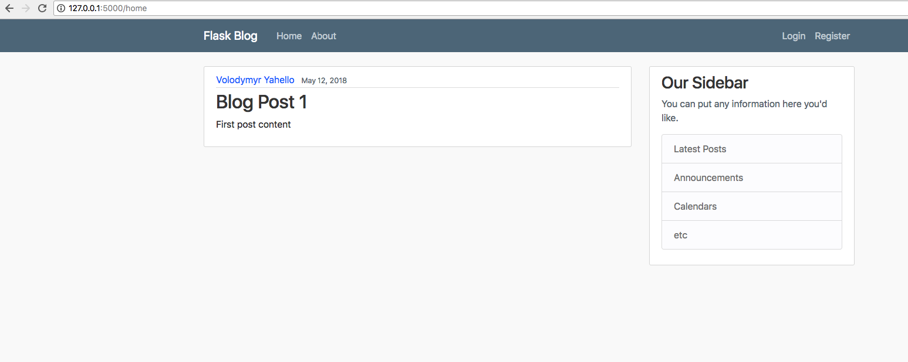
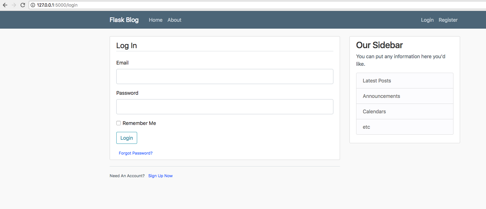
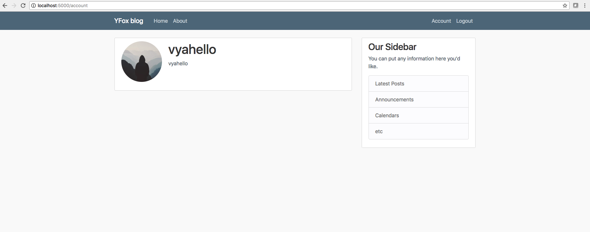
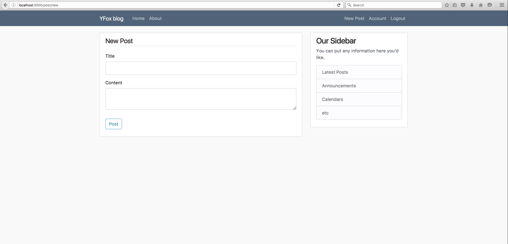
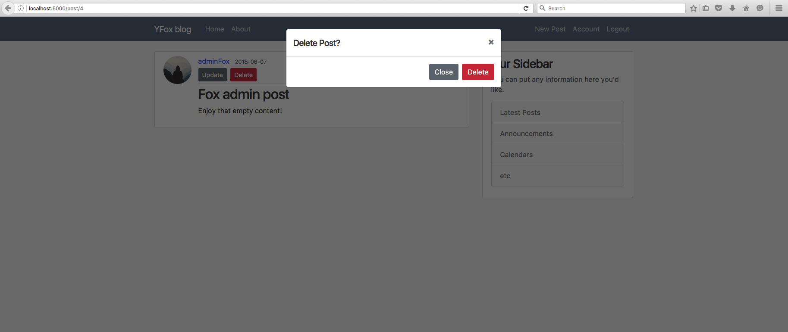

# YFox blog
Typically a simple blog written in flask - python micro-web framework. Enjoy it!

## Table of contents
- [Run a YFox blog](#run-a-yfox-blog)
  - [Structure](#structure)
    - [Home Page](#home-page)
    - [About Page](#about-page)
    - [Login Page](#login-page)
    - [Register Page](#register-page)
    - [Account Page](#account-page)
    - [New Post Page](#new-post-page)
    - [Delete Page](#delete-page)
- [Contributing](#contributing)
  - [Setup](#setup)
- [Run automated tests](#run-automated-tests)
  - [Using run-test script](#using-run-test-script)
  - [Advanced usage with pytest](#advanced-usage-with-pytest)
  - [Testing report](#testing-report)

## Run a YFox blog
Execute next command in your shell
```bash
~ python yfox.py
```

## Structure
### Home Page

### About Page

### Login Page

### Register Page

### Account page

### New Post page

### Delete Post


## Contributing

### Setup
- clone the repository
- configure Git for the first time after cloning with your name and email
  ```bash
  git config --local user.name "Volodymyr Yahello"
  git config --local user.email "vjagello93@gmail.com"
  ```
- `python3.6` is required to run the code
- run `pip install -r requirements.txt` to install all require python packages

## Run automated tests
### Using run-test script
- To run all tests please execute `./run-tests all` from shell in the root directory of the repository.
- To run basic smoke tests please execute `./run-tests smoke` from shell in the root directory of the repository.
- To run performance tests please execute `./run-tests performance` from shell in the root directory of the repository.
- To run unittests please execute `./run-tests unittest` from shell in the root directory of the repository.

#### Demo
```bash
(blog) ~/blog ./run-tests all
-------------------------------------
----- Running all tests -------------
-------------------------------------
============================================================================== test session starts ===============================================================================
platform darwin -- Python 3.6.5, pytest-3.5.1, py-1.5.3, pluggy-0.6.0 -- /home/.pyenv/versions/3.6.5/envs/blog/bin/python
Project: YFox flask blog
Written by: Volodymyr Yahello
collected 26 items                                                                                                                                                               

tests/functional/smoke/test_about.py::test_about_page_url PASSED                                                                                                           [  3%]
tests/functional/smoke/test_about.py::test_about_page_content PASSED                                                                                                       [  7%]
tests/functional/smoke/test_account.py::test_account_page_url PASSED                                                                                                       [ 11%]
tests/functional/smoke/test_account.py::test_account_page_content PASSED                                                                                                   [ 15%]
tests/functional/smoke/test_home.py::test_default_home_page_url PASSED                                                                                                     [ 19%]
tests/functional/smoke/test_home.py::test_home_page_url PASSED                                                                                                             [ 23%]
tests/functional/smoke/test_home.py::test_default_home_page_content PASSED                                                                                                 [ 26%]
tests/functional/smoke/test_home.py::test_home_page_content PASSED                                                                                                         [ 30%]
tests/functional/smoke/test_login.py::test_login_page_url PASSED                                                                                                           [ 34%]
tests/functional/smoke/test_login.py::test_login_page_content PASSED                                                                                                       [ 38%]
tests/functional/smoke/test_login.py::test_login_user PASSED                                                                                                               [ 42%]
tests/functional/smoke/test_posts.py::test_new_post PASSED                                                                                                                 [ 46%]
tests/functional/smoke/test_posts.py::test_existent_post PASSED                                                                                                            [ 50%]
tests/functional/smoke/test_posts.py::test_non_existent_post PASSED                                                                                                        [ 53%]
tests/functional/smoke/test_posts.py::test_update_existent_post PASSED                                                                                                     [ 57%]
tests/functional/smoke/test_posts.py::test_update_non_existent_post PASSED                                                                                                 [ 61%]
tests/functional/smoke/test_register.py::test_register_page_url PASSED                                                                                                     [ 65%]
tests/functional/smoke/test_register.py::test_register_page_content PASSED                                                                                                 [ 69%]
tests/functional/smoke/test_register.py::test_register_user PASSED                                                                                                         [ 73%]
tests/functional/unitests/test_posts.py::test_post_date PASSED                                                                                                             [ 76%]
tests/functional/unitests/test_posts.py::test_blog_post PASSED                                                                                                             [ 80%]
tests/non_functional/performance/test_endurance.py::test_endurance PASSED                                                                                                  [ 84%]
tests/non_functional/performance/test_load.py::test_load PASSED                                                                                                            [ 88%]
tests/non_functional/performance/test_smoke.py::test_smoke PASSED                                                                                                          [ 92%]
tests/non_functional/performance/test_spike.py::test_spike PASSED                                                                                                          [ 96%]
tests/non_functional/performance/test_stress.py::test_stress PASSED                                                                                                        [100%]

------------------------------------------------------- generated html file: /home/blog/test-report.html --------------------------------------------------------
=========================================================================== 26 passed in 42.24 seconds ===========================================================================
removing .pytest_cache testing trash
environment is cleared
```
### Advanced usage with pytest
Run tests with `pytest` for developing and debugging purposes mostly.
#### Demo
- Run tests with particular marker
```bash
(blog) ~/blog pytest --skip-marker performance -rs
============================================================================== test session starts ===============================================================================
platform darwin -- Python 3.6.5, pytest-3.5.1, py-1.5.3, pluggy-0.6.0 -- /home/.pyenv/versions/3.6.5/envs/blog/bin/python
Project: YFox flask blog
Written by: Volodymyr Yahello
collected 26 items                                                                                                                                                               

tests/functional/smoke/test_about.py::test_about_page_url PASSED                                                                                                           [  3%]
tests/functional/smoke/test_about.py::test_about_page_content PASSED                                                                                                       [  7%]
tests/functional/smoke/test_account.py::test_account_page_url PASSED                                                                                                       [ 11%]
tests/functional/smoke/test_account.py::test_account_page_content PASSED                                                                                                   [ 15%]
tests/functional/smoke/test_home.py::test_default_home_page_url PASSED                                                                                                     [ 19%]
tests/functional/smoke/test_home.py::test_home_page_url PASSED                                                                                                             [ 23%]
tests/functional/smoke/test_home.py::test_default_home_page_content PASSED                                                                                                 [ 26%]
tests/functional/smoke/test_home.py::test_home_page_content PASSED                                                                                                         [ 30%]
tests/functional/smoke/test_login.py::test_login_page_url PASSED                                                                                                           [ 34%]
tests/functional/smoke/test_login.py::test_login_page_content PASSED                                                                                                       [ 38%]
tests/functional/smoke/test_login.py::test_login_user PASSED                                                                                                               [ 42%]
tests/functional/smoke/test_posts.py::test_new_post PASSED                                                                                                                 [ 46%]
tests/functional/smoke/test_posts.py::test_existent_post PASSED                                                                                                            [ 50%]
tests/functional/smoke/test_posts.py::test_non_existent_post PASSED                                                                                                        [ 53%]
tests/functional/smoke/test_posts.py::test_update_existent_post PASSED                                                                                                     [ 57%]
tests/functional/smoke/test_posts.py::test_update_non_existent_post PASSED                                                                                                 [ 61%]
tests/functional/smoke/test_register.py::test_register_page_url PASSED                                                                                                     [ 65%]
tests/functional/smoke/test_register.py::test_register_page_content PASSED                                                                                                 [ 69%]
tests/functional/smoke/test_register.py::test_register_user PASSED                                                                                                         [ 73%]
tests/functional/unitests/test_posts.py::test_post_date PASSED                                                                                                             [ 76%]
tests/functional/unitests/test_posts.py::test_blog_post PASSED                                                                                                             [ 80%]
tests/non_functional/performance/test_endurance.py::test_endurance SKIPPED                                                                                                 [ 84%]
tests/non_functional/performance/test_load.py::test_load SKIPPED                                                                                                           [ 88%]
tests/non_functional/performance/test_smoke.py::test_smoke SKIPPED                                                                                                         [ 92%]
tests/non_functional/performance/test_spike.py::test_spike SKIPPED                                                                                                         [ 96%]
tests/non_functional/performance/test_stress.py::test_stress SKIPPED                                                                                                       [100%]
============================================================================ short test summary info =============================================================================
SKIP [5] /home/myprojects/blog/tests/plugins/hooks.py:48: Skipping [@performance] pytest marker
```
- Run tests with particular fixture
```bash
(blog) ~/blog pytest --use-fixtures register_url_response
============================================================================== test session starts ===============================================================================
platform darwin -- Python 3.6.5, pytest-3.5.1, py-1.5.3, pluggy-0.6.0 -- /home/.pyenv/versions/3.6.5/envs/blog/bin/python
Project: YFox flask blog
Written by: Volodymyr Yahello
collected 26 items / 24 deselected                                                                                                                                               

tests/functional/smoke/test_register.py::test_register_page_url PASSED                                                                                                     [ 50%]
tests/functional/smoke/test_register.py::test_register_page_content PASSED                                                                                                 [100%]

==================================================================== 2 passed, 24 deselected in 0.13 seconds =====================================================================
```

### Testing report
- Open `test-report.html` file after tests execution
#### Demo

